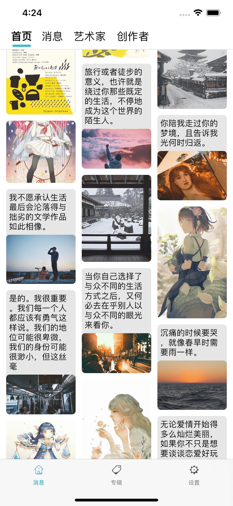

# 艺创小镇

技术支持请提[issue](https://github.com/gwh111/ArtTown/issues)，或查看最下方联系方式。

 
AI艺术的特点在于它需要人类的指导和操作，计算机程序在深度学习了大量人类艺术家的作品后生成艺术作品。AI艺术作品展现了非凡的想象力和时代感，但它们并不具备自我意识，也不诞生于特定的历史情境中。‌

尽管AI艺术在创作便捷性和创新性方面有着显著优势，但它是否算作艺术仍存在争议。一些观点认为，AI艺术作品缺乏自我意识和特定的历史情境，因此不能被视为真正的艺术。‌

艺创消息内容自动收集的工作原理类似于搜索引擎，是一款智能搜索、筛选、分析合一体的浏览器。

鉴于一些AI的经验，我设计了一个AI小助手，它每时每刻都在辛勤地工作，尽可能用它现有的能力去寻找网络上高质量的内容。经过一系列处理，将优化的内容和原文呈现给你。

我也在努力的优化它，它也在努力变成更好的自己。

# Contact & Support
Contact: Pat Gao
Mail: 173695508@qq.com
Tel: 15795833509
